# 在 vscode 中使用cmake并且一键运行 c++ 项目

 &emsp;&emsp;都说CLion香，可能确实香，但是不知道为啥在我的电脑上CLion不给我错误提示就很气。所以寻寻觅觅又转战回了vscode（vscode最香~）。好不容易跑通了一个hello world，必须做个笔记防止自己忘咯哈哈哈。
 
 

## 需要提前安装的工具
---
- VS Code 
- [CMake](https://cmake.org/download/) : c++工程的编译工具，会根据各种依赖生成一个makefile 
- [ninja](https://github.com/ninja-build/ninja/releases) : 也是构建工程用的 
- Clang(windows上用MINGW) : 编译c++的，mac上应该自带 

## 可能用到的插件
---
- C/C++ : 提供c++调试功能和一些智能提示 
  
- C++ Intellisense: 智能提示 
  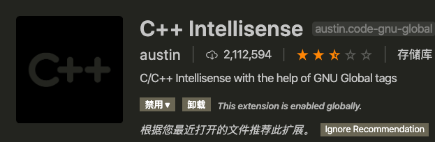
- CMake : 提供CMake支持的 
  
- CMake Tools : 拓展CMake功能的 
  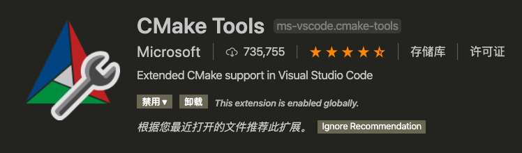
- macro-commander: 组合vscode命令的插件，可能用不上 
  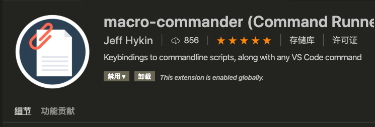
## 使用方法
---

1. 首先把那个忍者也就是那个 ninja 给拷贝到 CMake 的bin目录下
  

2. 把上面那些乱七八糟的vscode插件安上
  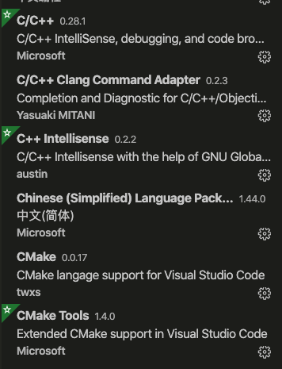

3. 安装完插件之后，可以尝试随便创建一个c++项目 
   然后流畅地在里面写下 hello world !!!
  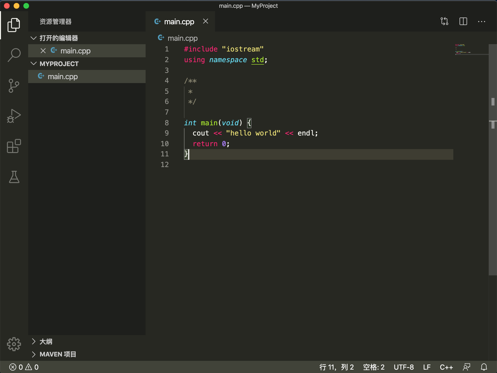

4. 这个时候CMake的插件应该会在vscode的左下角显示出来 
  
  如果没显示有两种方法，第一种玩下手机等一会儿，它可能反应慢。 
  第二种在项目中创建一个 CMakeLists.txt 的文件 这样可以激活 CMake 插件
  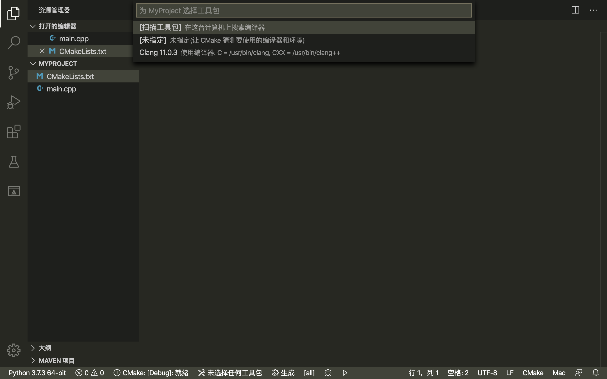

5. 点击下面的生成之后选择编译器
  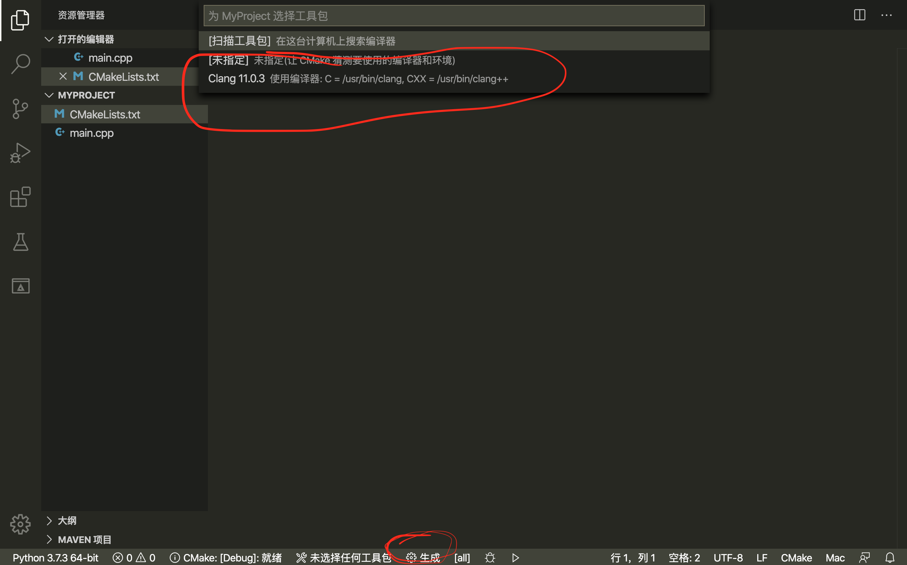
  这个时候会在根目录下生成一个build目录，这个目录中有个Makefile
  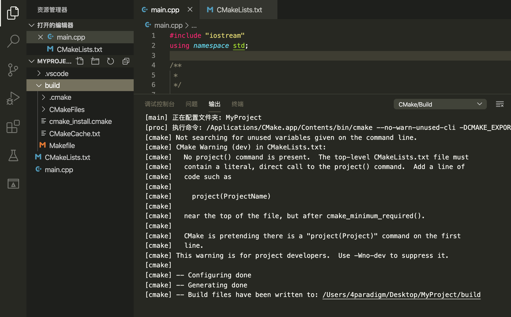
  但是这个时候make它没啥用，因为CMake会去找CMakeLists.txt文件的配置项，
  这个文件里头啥也没写，所以编译出来的makefile屁用没有。

6. 先简单地构建一个包含外链接的hello world项目，main中引入了hello的头文件并且使用了 say_hello 方法打印一个 gakki
  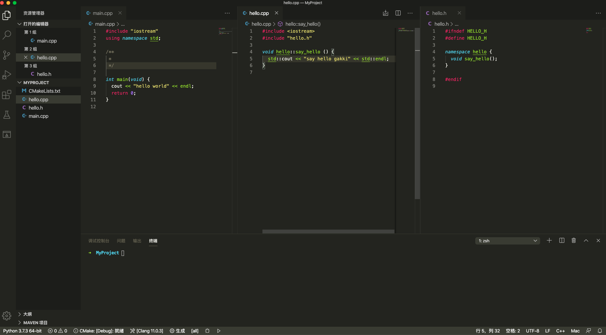

7. 编写一个简单的 CMakeLists.txt 文件 
   一般情况下，写完这个 CMakeLists.txt 保存的同时就会自动执行生成makefile过程。
  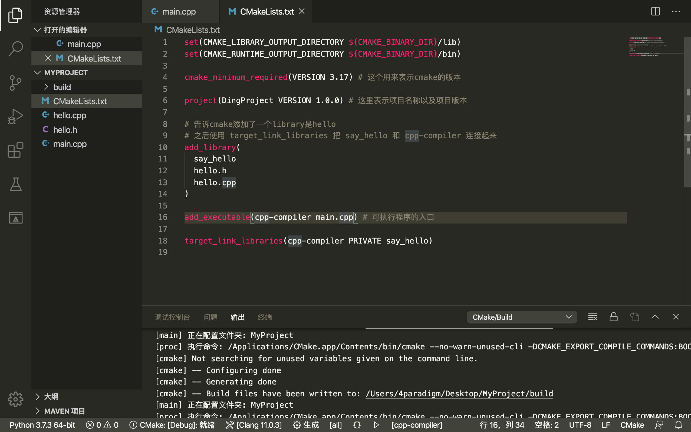
  如果没自动执行的话就点一下左侧边栏中的CMake插件的按钮。
  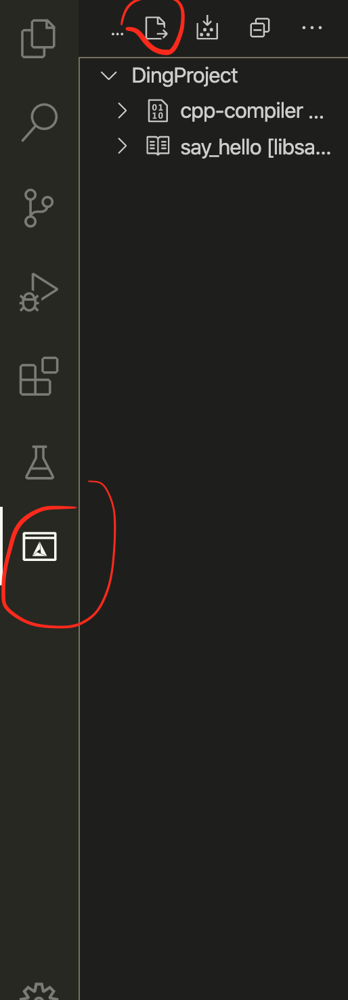

8. 这个时候根目录下会自动生成一个 build 目录和 Makefile 文件 
   可以进入 build 目录手动执行 Makefile 也可以直接点击 vscode 下边那个小箭头就会自动 make 这个 Makefile 并且执行编译出来的可执行文件
  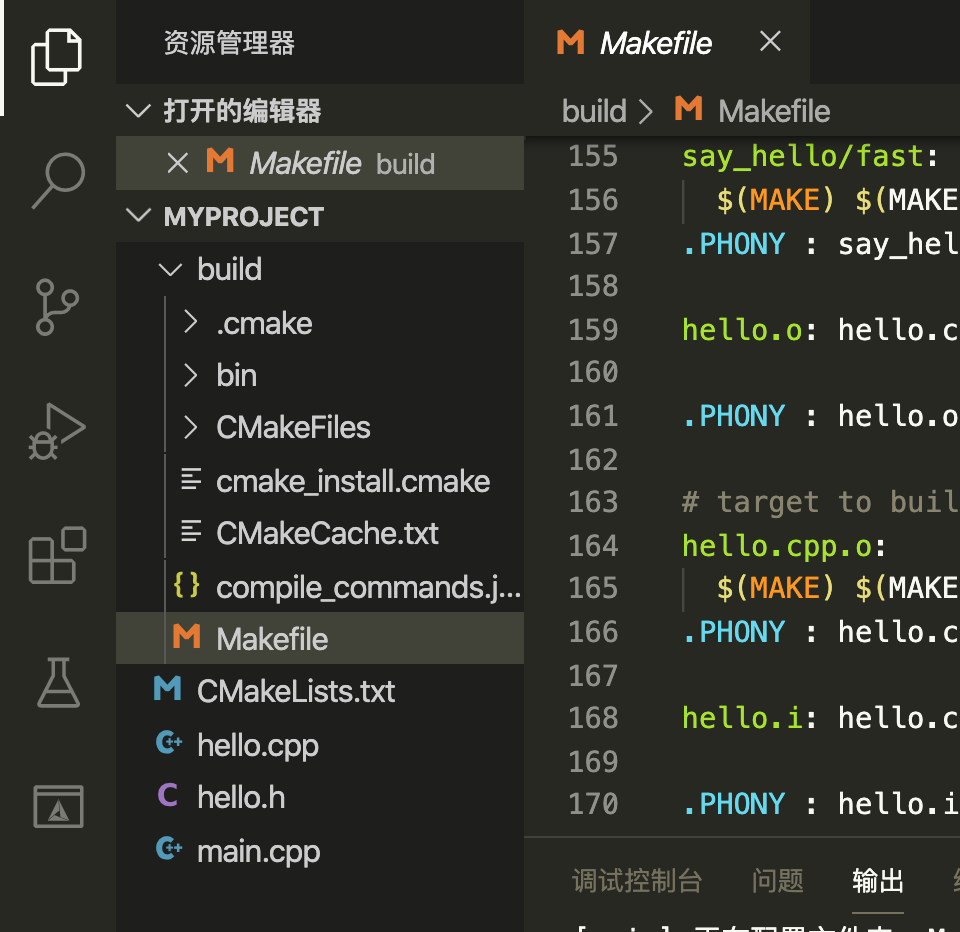

9. 至此为止，基本上 vscode 配合 cmake 执行 c++ 代码就差不多搞定了。现在修改完代码之后，只需要点击一下vscode下面的运行的小箭头就能自动编译makefile以及执行了。debug的话点击下面那个小虫子就行了(debug我这儿有时候还不好使......)。
  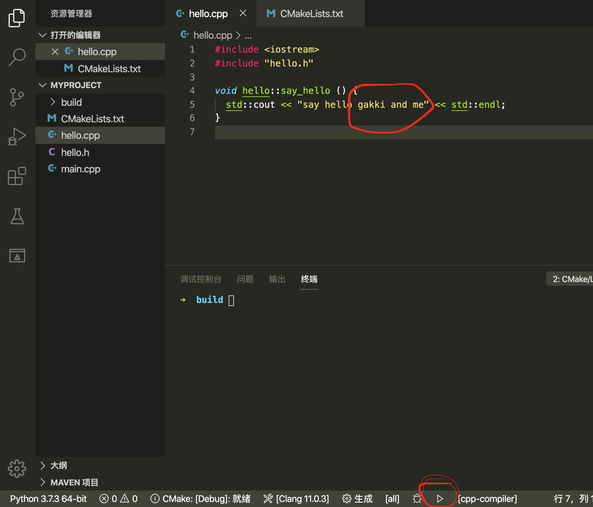
  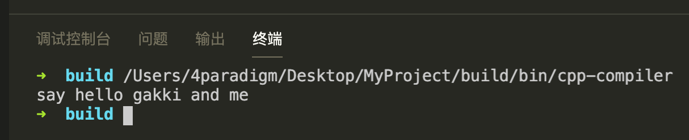

10. 最后，虽然现在跑起来已经挺方便了，但是我个人更喜欢使用快捷键的方式一键运行。
  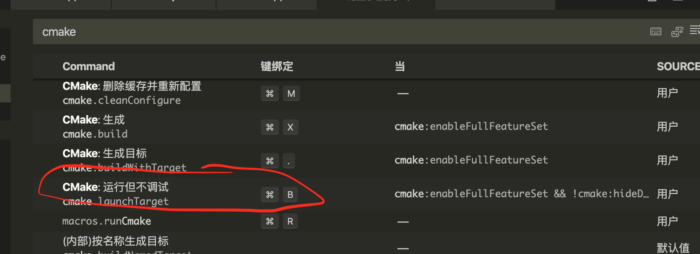
  另外 CMake 提供了很多功能，可以对这些功能自由配置快捷键，还可以使用 [macro-commander](https://github.com/jeff-hykin/macro-commander) 这个插件去自由组合这些快捷键命令的执行顺序。

P.S. 如果哪里有问题请指出， 谢谢

